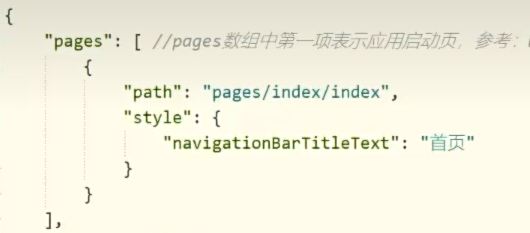

1. 申请小程序测试号

- 邮箱激活
- 公司主体类型选企业
  AppID(小程序ID):`wx4389100f4c3eca94`

2. 创建项目
   - 在HBuilderX中新建项目，选择uni-app,默认模板
   - 安装插件：vue3编译器插件【第一次】
   - 运行：（微信开发者发工具/百度...）
   - 微信开发者工具打开服务端口【第一次】

3. `pages.json` 配置页面路由，导航栏，tabBar等页面类信息

- 
- globalStyle 全局样式，比如导航栏颜色

4. 静态资源放`static`文件夹下。否则不能打包

5. 一些小点
   - `<scroll-view>`自带滚动效果的组件标签
   - `active`改变右边框从透明编颜色显示当前点击对象
   - 子绝父相
   - `\n\n` 是换行符，两个连在一起表示空一行

- `uni.showModal` 是 uni-app 的内置 API ,它会自动生成一个系统风格弹窗，样式是固定的，不需要你自己写 CSS。
- `Object.values()` 的作用
  把对象的值抽出来，变成一个数组。为了用数组方法
- 为什么用 `cart[dish.id]`？ 因为 dish.id 是变量，方括号语法支持变量作为属性名
  方括号 = 属性名是动态算出来的；点语法 = 属性名是固定写死的。
- `delete` 的作用,删除对象上的某个属性。

```js
 const cart = {
    v1: { name: '清炒时蔬', count: 2 },
    m1: { name: '红烧肉', count: 1 }
}
delete cart['v1']
// cart 变成：
{
    m1: { name: '红烧肉', count: 1 }
}
// 'v1' 这个属性被删掉了
```

### 组件封装步骤

- 先把结构剪切过来，然后数据通信 ，修改结构里面子组件用的父组件的方法
